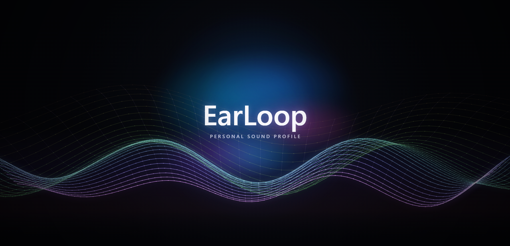
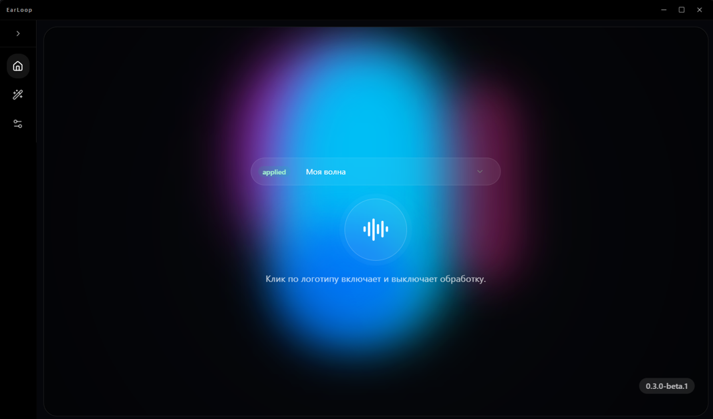
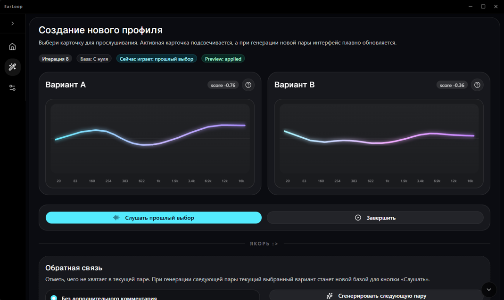

<div align="center">

# EarLoop

### Персональный эквалайзер с интерактивной настройкой звучания

EarLoop обрабатывает системный звук Windows в реальном времени и помогает создать индивидуальный профиль эквалайзера с помощью последовательных A/B-сравнений.

**Статус:** Beta · **Платформа:** Windows · **Лицензия:** GNU GPL v3




</div>

---

## О проекте

EarLoop — desktop-приложение для персонализации звучания наушников и других аудиоустройств.

Вместо ручной настройки большого количества частотных полос пользователь проходит A/B-сессию: приложение предлагает два варианта обработки звука, а пользователь выбирает тот, который звучит лучше. На основе ответов EarLoop постепенно формирует персональный профиль эквализации.

Приложение захватывает системный аудиопоток Windows, применяет обработку в реальном времени и направляет результат на выбранное устройство воспроизведения.


## Возможности

- обработка системного звука Windows в реальном времени;
- выбор устройства воспроизведения;
- параметрическая эквализация аудиосигнала;
- интерактивная A/B-персонализация звучания;
- автоматическое обновление модели предпочтений;
- создание и сохранение пользовательских профилей;
- переключение между вариантами обработки без остановки аудиопотока;
- графический интерфейс для управления профилями и аудиодвижком;
- сборка в отдельное desktop-приложение для Windows.

## Интерфейс

<p align="center">
  
</p>

## Как работает A/B-персонализация

1. Пользователь запускает воспроизведение музыки.
2. EarLoop захватывает системный аудиопоток.
3. Приложение формирует два варианта эквализации — **A** и **B**.
4. Пользователь сравнивает варианты и выбирает предпочтительный.
5. Модель предпочтений обновляется после каждого ответа.
6. По завершении сессии результат сохраняется как персональный профиль.
7. Профиль применяется к системному звуку в реальном времени.


<p align="center">
  
</p>

## Установка и запуск

Готовые сборки EarLoop для Windows публикуются в разделе
[GitHub Releases](https://github.com/Parcart/EarLoop/releases).

Для разработки и сборки проекта из исходников:

- [Запуск в режиме разработки](./docs/DEVELOPMENT.md)
- [Сборка desktop-приложения](./docs/BUILDING.md)

> EarLoop находится в стадии beta-тестирования. Возможны ошибки, изменения формата профилей и нестабильная работа с отдельными аудиоустройствами.


## Технологии

### Аудиодвижок и персонализация

- Python;
- NumPy;
- SciPy;
- sounddevice;
- soundcard;
- soundfile;
- PyInstaller.

### Пользовательский интерфейс

- React;
- TypeScript;
- Vite;
- Tailwind CSS;
- Electron;
- Framer Motion;
- Radix UI.

## Структура проекта

```text
EarLoop/
├── requirements/        # Python-зависимости для runtime и сборки
├── research/            # Исследования и завершённые прототипы
├── scripts/             # Сценарии сборки и вспомогательные инструменты
├── src/
│   └── earloop/
│       ├── audio/       # Обработка аудио и DSP
│       ├── data/        # Подготовка данных
│       ├── engine/      # Команды, состояние и backend приложения
│       ├── ml/          # Персонализация и модель предпочтений
│       └── utils/       # Общие вспомогательные модули
├── tools/               # Вспомогательные инструменты проекта
├── ui/
│   ├── desktop/         # Electron-приложение
│   ├── dev/             # Bridge между Vite и Python
│   ├── public/          # Статические ресурсы
│   └── src/             # React-интерфейс
└── LICENSE
```

## Исследовательская часть

Каталог [`research/`](research/) содержит эксперименты, которые использовались при разработке EarLoop:

- анализ кривых AutoEQ;
- анализ пользовательских настроек SocialFX;
- проектирование компактного эквалайзера;
- эксперименты с генерацией A/B-пар;
- исследование моделей пользовательских предпочтений;
- ранний CLI-прототип персонализации.

CLI-прототип в `research` считается завершённым исследовательским этапом. Он сохраняется в репозитории как часть истории разработки и не является основным способом запуска приложения.

Подробнее: [`research/README.md`](research/README.md).

## Статус разработки

EarLoop находится в стадии активной разработки и beta-тестирования.

На текущем этапе возможны:

- изменения пользовательского интерфейса;
- изменения алгоритмов персонализации;
- изменения формата пользовательских профилей;
- повышенная задержка при некоторых конфигурациях;
- нестабильная работа с отдельными аудиодрайверами;
- визуальные и функциональные ошибки.

## Планы развития

- публикация готовых сборок в GitHub Releases;
- улучшение стабильности аудиодвижка;
- уменьшение задержки обработки;
- развитие алгоритма A/B-персонализации;
- улучшение диагностики аудиоустройств;
- визуализация итоговой EQ-кривой;
- улучшение импорта и экспорта профилей;
- автоматизация сборок и проверок через CI.

## Участие в разработке

Сообщения об ошибках, предложения и pull request приветствуются.

Перед отправкой изменений рекомендуется проверить интерфейс:

```powershell
cd ui
npm run lint
npm run build
```

При описании ошибки укажите:

- версию Windows;
- используемое аудиоустройство;
- шаги для воспроизведения;
- ожидаемое и фактическое поведение;
- логи приложения, если они доступны.

## Лицензия

Проект распространяется на условиях **GNU General Public License v3.0**.

Подробности находятся в файле [`LICENSE`](LICENSE).